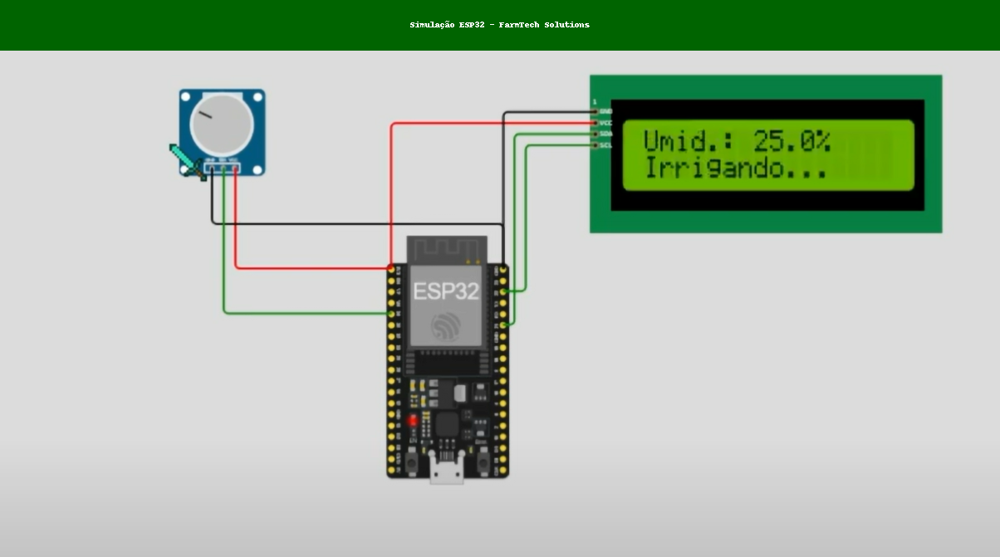
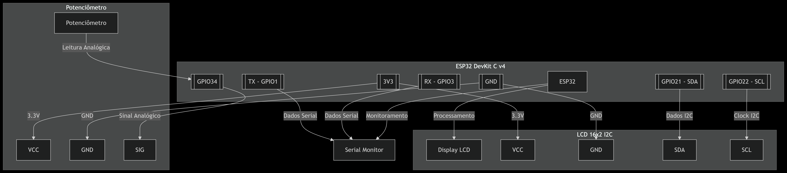
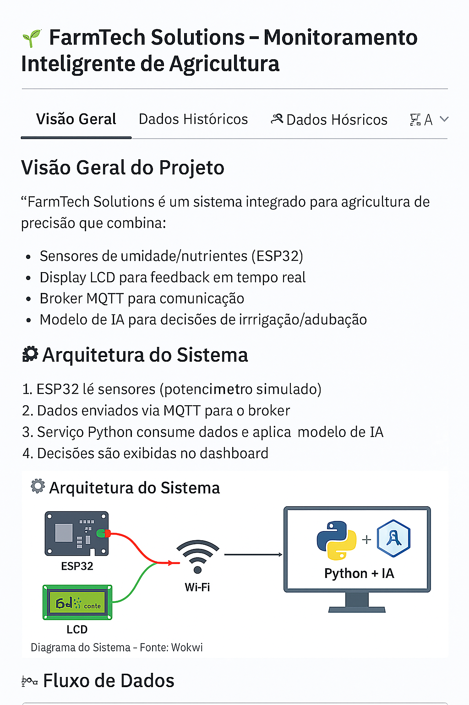
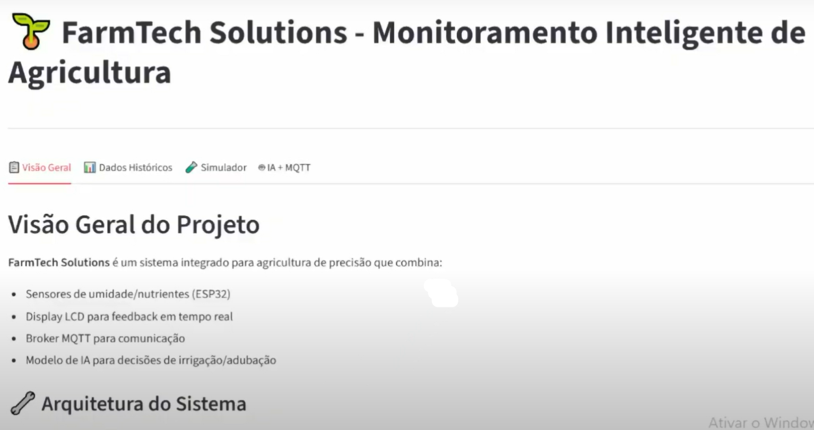
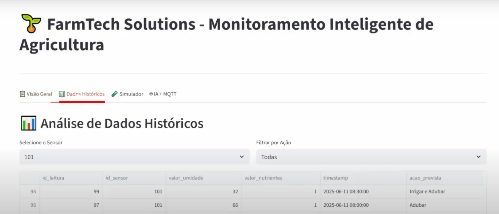
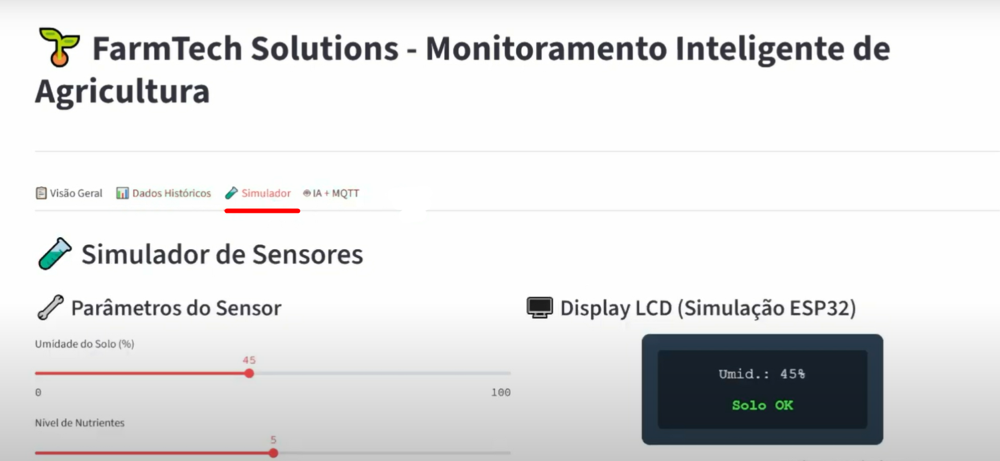
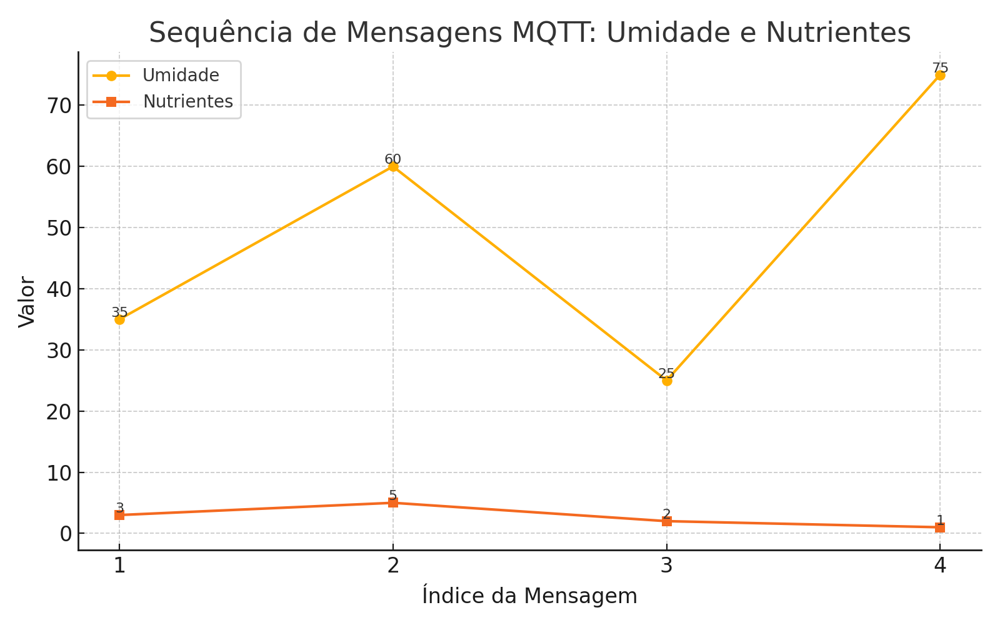

<p align="center">
  <a href="https://www.fiap.com.br/">
    
  </a>
</p>

<br>

# Cap 1 - Automação e Inteligência na FarmTech Solutions


---

## Índice

1. [Equipe e Professores](#equipe-e-professores)
2. [Visão Geral do Projeto](#visão-geral-do-projeto)
3. [Estrutura do Repositório](#estrutura-do-repositório)
4. [Links Uteis Disponíveis](#descrição-links)
   - [Descrição Técnica](#descrição-técnica)
   - [Modelo Preditivo de Irrigação (Fase 4)](#modelo-preditivo-de-irrigação-fase-4)
   - [Simulação ESP32 / Wokwi](#simulação-esp32--wokwi)
   - [Código C/C++ para ESP32](#código-cc-para-esp32)
   - [Pipeline Python / Machine Learning](#pipeline-python--machine-learning)
   - [Dashboard Web com Streamlit](#dashboard-web-com-streamlit)
   - [Integração MQTT](#integração-mqtt)
5. [Tecnologias e Dependências](#tecnologias-e-dependências)
6. [Instruções de Instalação e Execução](#instruções-de-instalação-e-execução)
7. [Biblioteca Utilizada](#detalhes-dos-dados)
8. [Licença](#licença)
10. [Recursos Rápidos](Recursos)
---

## Equipe e Professores

- **Nome do Projeto:** Automação e Inteligência na FarmTech Solutions
- **Nome do Grupo:** Equipe FIAP

### Integrantes
- [João Vitor](fontesjoaovittor@gmail.com)
- [Vinicius](nisoxds@gmail.com)
- [Endrew Alves](Endrewalves42@gmail.com)
- [Tayná Esteves](esteves.tayna96@gmail.com)
- [Carlos Eduardo](carlos.souza004@gmail.com)

### Professores
- **Tutor(a):** [André Godoi Chiovato](profandre.chiovato@fiap.com.br)
- **Coordenador(a):** [Lucas Gomes Moreira](proflucas.moreira@fiap.com.br)

---

## Visão Geral do Projeto

**FarmTech Solutions**
🌱 FarmTech Solutions – Agricultura de Precisão com IoT e IA

📌 Visão Geral do Projeto
FarmTech Solutions é um sistema de agricultura de precisão desenvolvido para demonstrar a integração entre tecnologias de sensoriamento, comunicação IoT, aprendizado de máquina e visualização interativa de dados. Atualmente em sua Fase 4 de evolução, o projeto representa a transição de uma automação simples baseada em regras para uma abordagem preditiva, fundamentada em dados históricos e Inteligência Artificial.

Este repositório integra todos os módulos do sistema: aquisição de dados, comunicação MQTT, modelos de Machine Learning, banco de dados e dashboard interativo.

🎯 Objetivos
Automatizar decisões agrícolas com base em dados reais e históricos.

Demonstrar o uso de IoT, Machine Learning e visualização de dados em um contexto agrícola.

Permitir testes com sensores reais (ESP32) ou simulações.

Fornecer uma base educacional para pesquisadores, estudantes e desenvolvedores interessados em AgTech.

Preparar o sistema para uma possível automação física com atuadores e controladores lógicos programáveis (CLPs/PLCs).

---

## Estrutura do Repositório

```
/
├── README.md
├── app.py                          # Aplicação Streamlit
├── farmtech_leituras_formatado.csv # Base de dados simulada
├── requirements.txt                # Lista de dependências
├── prediction_model.py             # Modelo de previsão
└── env/                            # Variaveis do Sistema
    └── ....
├── assets/
│   └── logo-fiap.png
├── data/
│   └── farmtech_leituras_formatado.csv
├── model/
│   ├── modelo_irrigacao.joblib
│   └── label_encoder.joblib
├── src/
│   ├── prediction_system.py
│   ├── mqtt_client.py
│   └── app.py
├── firmware/
│   └── esp32/
│       └── farmtech_esp32.ino
├── docs/
│       ├── DadosHistoricos_2.png
│       ├── ESP32.png
│       ├── IA_MQTT_4.png
│       ├── Simulador_3.png
│       ├── VisaoGerak_1.png
│       ├── diagram-eaquematico.png
│       ├── diagrama-sensores.png
│       ├── improved_dashboard.png
│       ├── replit_mqtt_terminal_high_quality.png
│       ├── simulacao_esp32_farmtech.png
        └── sequencia_mqtt.png
├── .gitignore
└── LICENSE
```

## Links Úteis Disponíveis

 ### [Simular o Projeto no Wokwi](https://wokwi.com/projects/434020356732481537)

  Ambiente de simulação de hardware virtual para prototipagem de firmware e lógica de IoT.  
  - **Objetivo**: testar fluxos de leitura de sensores (e.g., temperatura, umidade, luminosidade) e atuadores (e.g., válvulas de irrigação) em ESP32 ou outras placas suportadas, sem necessidade de hardware físico.  
  - **Uso**: valide a lógica de coleta de dados, comunicação via MQTT ou HTTP, e depure o código em C/C++ ou MicroPython no ambiente integrado do Wokwi.  
  - **Benefícios**: acelera o desenvolvimento e a experimentação de cenários (edge computing), permitindo ajustes no código antes de implantar em campo.


 ### [Vídeo Demonstração – Automação e Inteligência Artificial na FarmaTech Solutions](https://www.youtube.com/watch?v=89fUrCubX3g)

  Demonstração prática de todo o fluxo de Agricultura de Precisão: do sensoriamento à tomada de decisão com IA.  
  - **Conteúdo Técnico**: exemplifica a arquitetura de sensores conectados (rede de sensores wireless, ESP32/MCU, gateway), comunicação via MQTT ou RESTful APIs, pipeline de dados (ingestão, armazenamento em nuvem), e aplicação de modelos de Machine Learning para previsão de irrigação, detecção de anomalias e otimização de recursos.  
  - **Aprendizado**: mostra dashboards de monitoramento (visualização de telemetria em tempo real), uso de frameworks de IA (pode incluir bibliotecas Python, TensorFlow/PyTorch ou serviços gerenciados), e automação de atuadores com base em regras ou inferências de ML.

 ### [Integração MQTT – Exemplo no Replit](https://replit.com/@estevestayna96/farmtech-mqtt#mqtt_modelo_farmtech.py) 

  Código de referência em Python para client MQTT, demonstrando publicação/assinatura de tópicos de sensoriamento e comandos de atuação.  
  - **Biblioteca**: geralmente utiliza `paho-mqtt` ou similar, mostrando configuração de broker (e.g., broker público ou privado via TLS), definição de tópicos (namespaces para sensores de solo, clima, atuadores de bomba) e QoS.  
  - **Arquitetura**: exemplifica como integrar dispositivos de borda (edge) com backend em nuvem ou servidor local, interpretando JSON payloads, tratando reconexões, e permitindo escalabilidade de telemetria.  
  - **Extensões possíveis**: adicionar autenticação via certificados, persistência em banco de dados (TimescaleDB, InfluxDB), integração com dashboards (Grafana, Node-RED) e orquestração de microserviços.

---
```


## Descrição Técnica

### Modelo Preditivo de Irrigação (Fase 4)

- Features:
  - Umidade do Solo (%) (0 a 100).
  - Nível de Nutrientes (0–10).
- Classes:
  - Irrigar
  - Adubar
  - Irrigar e Adubar
  - Nenhuma ação
- Abordagem:
  - Decision Tree (scikit-learn).
  - Normalização simples (ex.: dividir umidade por 100, nutrientes por 10).
  - Cálculo de confiança: probabilidade máxima × 100.
  - Cache de predições com timestamp (classe PredictionSystem).

## Descrição Técnica

Esta seção detalha os aspectos técnicos do sistema FarmTech Solutions, especialmente o modelo preditivo de irrigação/adubação (Fase 4) e seus componentes auxiliares. O objetivo é fornecer clareza sobre o funcionamento interno, pré-processamento de dados, arquitetura do modelo, métricas e integração com o ecossistema IoT.

### 1. Modelo Preditivo de Irrigação/Adubação (Fase 4)

O modelo é responsável por recomendar ações agronômicas (irrigar, adubar, ambos ou nenhuma ação) com base em leituras de umidade do solo e nível de nutrientes. A implementação atual utiliza uma árvore de decisão (Decision Tree) do scikit-learn, mas a arquitetura é modular para permitir troca ou atualização por outros algoritmos (Random Forest, XGBoost, etc.) no futuro.

#### 1.1. Features (Entradas)
- **Umidade do Solo (%)**  
  - Intervalo esperado: 0 a 100.  
  - Pré-processamento: normalização simples dividindo o valor por 100 (escala 0.0–1.0).
- **Nível de Nutrientes**  
  - Intervalo simulado: 0 a 10 (unidades arbitrárias adotadas pela simulação).  
  - Pré-processamento: normalização dividindo o valor por 10 (escala 0.0–1.0).

> Observação: caso haja outros sensores (por exemplo, temperatura ou pH), a arquitetura permite incluir novas colunas no vetor de features, com transformações/padronizações adequadas.

#### 1.2. Classes (Saídas)
- **Irrigar**  
- **Adubar**  
- **Irrigar e Adubar**  
- **Nenhuma ação**

> As classes são definidas conforme regras de negócio ou via rotulagem histórica de dados: por exemplo, se umidade < 40% e nutrientes < 4 → “Irrigar e Adubar”. A árvore de decisão aprende padrões a partir de dados rotulados, mas também há regras iniciais para simulação e geração de rótulos em ambiente de teste.

#### 1.3. Arquitetura e Implementação
- **Algoritmo Principal**:  
  - `DecisionTreeClassifier` do scikit-learn (versão recomendada: 1.4.2).  
  - Critério padrão (Gini), profundidade e outros hiperparâmetros ajustáveis via grid search ou validação cruzada.
- **Pipeline de Pré-processamento**:  
  1. Leitura de valores brutos (umidade em %, nutrientes em escala 0–10).  
  2. Normalização: `umidade_norm = umidade / 100.0`, `nutrientes_norm = nutrientes / 10.0`.  
  3. Construção de array 2D para predição: `X = np.array([[umidade_norm, nutrientes_norm]])`.
- **Cálculo de Confiança**:  
  - Após `predict_proba`, extrai-se a maior probabilidade de classe:  
    ```python
    probabilities = model.predict_proba(X)[0]       # ex.: [0.1, 0.7, 0.15, 0.05]
    confidence = np.max(probabilities) * 100        # ex.: 70.0 (%)
    ```
  - Essa confiança é retornada ao usuário/serviço para exibição ou lógica adicional (ex.: alertar se confiança baixa).
- **Cache de Predições**:  
  - Classe `PredictionSystem` implementa cache em memória:  
    - Chave: timestamp (`datetime.now()`)  
    - Valor: dicionário contendo `umidade`, `nutrientes`, `prediction` (classe prevista) e `confidence`.  
  - Uso: permite auditoria ou monitoramento de histórico de predições em sessão ativa.  
  - Importante: em cenários de produção, pode-se substituir cache em memória por persistência em banco de dados (SQLite, PostgreSQL, etc.) para análises posteriores.
- **Persistência do Modelo**:  
  - Treinamento offline: gera-se arquivo serializado com `joblib.dump(model, "model.pkl")`.  
  - No runtime, carrega-se com `joblib.load("model.pkl")`.  
  - Versão recomendada: Python ≥ 3.10 e scikit-learn compatível.  
- **Treinamento e Validação**:  
  - Conjunto de dados histórico: CSV de leituras rotuladas ou gerado via simulação + regras.  
  - Fluxo típico:  
    1. Carregar dataset (pandas).  
    2. Pré-processar features e labels.  
    3. Dividir em treino/teste (ex.: `train_test_split`, estratificado por classe).  
    4. Treinar `DecisionTreeClassifier`.  
    5. Avaliar métricas (accuracy, precision, recall, F1-score por classe).  
    6. Ajustar hiperparâmetros (GridSearchCV ou RandomizedSearchCV).  
    7. Persistir modelo final e registrar métricas em relatório (opcional: TensorBoard ou logging customizado).  
  - É recomendado armazenar a versão do modelo e data de treinamento, para rastreabilidade e re-treinamentos futuros.

### 2. Integração IoT e Comunicação

#### 2.1. Protocolo MQTT
- Biblioteca: `paho-mqtt` (versão recomendada: 1.6.1).  
- Fluxo:  
  1. **ESP32** publica leituras de umidade/nutrientes em tópico MQTT (ex.: `farmtech/sensores/{id_sensor}`).  
  2. Serviço Python (backend) faz subscribe nesses tópicos e consome mensagens em tempo real.  
  3. Cada mensagem acionará o `PredictionSystem.predict_with_confidence`, resultando em recomendação de ação.  
  4. Serviço pode publicar decisão de volta em outro tópico (ex.: `farmtech/acoes/{id_sensor}`) ou apenas exibir no dashboard.
- Configuração: host, porta, credenciais (se necessário) configuráveis via variáveis de ambiente ou arquivo `.env`.  
- Threading/Concorrência:  
  - No `app.py`, pode-se iniciar cliente MQTT em thread separada, assegurando que o loop de escuta não bloqueie a interface Streamlit.  
  - Exemplo:  
    ```python
    def on_message(client, userdata, msg):
        # parse JSON, executar predição e armazenar resultado em sessão ou DB
        ...
    mqtt_client = mqtt.Client()
    mqtt_client.on_message = on_message
    mqtt_client.connect(host, port)
    threading.Thread(target=mqtt_client.loop_forever, daemon=True).start()
    ```

#### 2.2. Simulação de Sensores
- **ESP32 em Wokwi**: uso de potenciômetro simulado para representar umidade.  
- **Código firmware**: conecta ao broker MQTT e publica leituras; exibe localmente em LCD I2C.  
- **Streamlit**: simula sensores via sliders; construção de JSON compatível com formato MQTT, permitindo testar pipeline sem hardware físico.

### 3. Dashboard Interativo (Streamlit)

- Arquivo principal: `app.py`.  
- Abas principais:
  - **Visão Geral**: métricas chave (total de leituras, média de umidade, ação mais comum).
  - **Dados Históricos**: carregamento de `farmtech_leituras_formatado.csv` ou banco de dados, filtros por sensor/ação, exibição em tabela, gráficos de série temporal e distribuição de ações.
  - **Simulador de Sensores**: sliders para umidade e nutrientes, botão “Enviar Leitura Simulada”, exibição de “LCD” via HTML/CSS incorporado.
  - **IA + MQTT**:  
    - Simulação manual de decisão (logica condicional ou uso direto de `PredictionSystem`).  
    - Simulação de fluxo MQTT (envio sequencial de mensagens e exibição de resposta IA com barra de progresso).
- Bibliotecas:  
  - `streamlit` (versão recomendada: ≥1.35.0).  
  - `matplotlib` para gráficos customizados (atenção: não usar seaborn para evitar dependências extras).  
  - `pandas` para manipulação de datasets.  
- Estrutura de configuração: argumentos de linha de comando ou variáveis de ambiente para definir caminhos (ex.: local do CSV, credenciais do broker).  
- UI/UX: clareza com títulos, seções bem definidas, uso de ícones/emojis para facilitar entendimento, responsividade mínima (layout wide).

### 4. Armazenamento e Dados Históricos

- **CSV local**: `farmtech_leituras_formatado.csv` usado para protótipo; colunas esperadas:
  - `timestamp` (string ou datetime)  
  - `id_sensor` (identificador único ou nome de nó)  
  - `valor_umidade` (0–100)  
  - `valor_nutrientes` (0–10)  
  - `acao_prevista` (string, categoria de ação)  
- **Banco de Dados Relacional (opcional)**:  
  - Recomenda-se, em ambientes de produção ou POCs mais complexos, utilizar SQLite, PostgreSQL ou outro SGBD.  
  - Tabelas sugeridas:  
    - `leituras` (id, timestamp, id_sensor, umidade, nutrientes)  
    - `predicoes` (id, timestamp, id_sensor, acao_prevista, confianca)  
  - Vantagens: consultas SQL, índices para acelerar filtros, integridade referencial.
- **Transformações de Timestamp**:  
  - Ao ler CSV, converter coluna `timestamp` para tipo datetime (`pd.to_datetime`) para gráficos e ordenação correta.  
  - Armazenar em UTC ou timezone local, mas manter consistência.

### 5. Monitoramento e Logging

- **Logging no Backend**:  
  - Utilizar módulo `logging` do Python para registrar eventos (conexão MQTT, mensagens recebidas, previsões, erros).  
  - Configurar níveis: DEBUG para desenvolvimento, INFO para produção, WARN/ERROR conforme criticidade.
- **Monitoramento de Previsões**:  
  - O cache em memória pode ser estendido a logs persistentes.  
  - Exemplos: gravar cada predição em arquivo de log ou banco de dados para análise de desempenho ao longo do tempo (drift de dados).
- **Tratamento de Erros**:  
  - Validar valores de entrada (ex.: garantir que umidade esteja em 0–100, nutrientes em 0–10).  
  - Capturar exceções de conexão MQTT e reconectar automaticamente.  
  - Em Streamlit, exibir mensagens de erro amigáveis sem quebrar a aplicação.

### 6. Testes e Validação

- **Testes Unitários**:  
  - Criar testes para a classe `PredictionSystem`:  
    - Verificar pré-processamento correto (normalização).  
    - Verificar cálculo de confiança (com mocks de `predict_proba`).  
    - Verificar cache sendo populado com chave de timestamp e dados corretos.
- **Testes de Integração**:  
  - Simular mensagens MQTT e verificar se a aplicação backend responde como esperado.  
  - Testar fluxo end-to-end: simulação de sensores via Streamlit → predição → exibição.
- **Validação de Modelo**:  
  - Avaliar métricas em dataset de teste separado.  
  - Em casos de baixa performance, coletar mais dados ou ajustar hiperparâmetros.
- **Reprodutibilidade**:  
  - Fixar seeds (ex.: `random_state` em DecisionTreeClassifier).  
  - Documentar versões de bibliotecas em `requirements.txt`.

### 7. Configurações e Variáveis de Ambiente

- Arquivo `.env` (pode usar `python-dotenv`):
  - `MQTT_BROKER_HOST`  
  - `MQTT_BROKER_PORT`  
  - `MQTT_USERNAME` / `MQTT_PASSWORD` (se aplicável)  
  - `DATA_CSV_PATH` (caminho para CSV de leituras)  
  - `MODEL_PATH` (caminho para modelo serializado, ex.: `model.pkl`)  
- Permite flexibilidade entre diferentes ambientes (desenvolvimento, teste, produção).

### 8. Extensibilidade e Futuros Melhoramentos

- **Modelos Avançados**:  
  - Incorporar algoritmos de ensemble (Random Forest, Gradient Boosting), redes neurais leves ou frameworks de AutoML.  
  - Análise de séries temporais para detectar tendências ou sazonalidade (ex.: Prophet para anomalias em consumo de água).  
- **Integração com Atuadores**:  
  - Extender o sistema para enviar comandos para válvulas de irrigação automáticas via MQTT ou protocolos industriais.  
  - Uso de PLCs/CLPs ou scripts de automação direta.
- **Dashboard Avançado**:  
  - Migração parcial ou complemento com front-end mais robusto (Dash, React) ou dashboards no Power BI usando API de dados.  
  - Alertas via e-mail/SMS quando predições indicarem urgência.
- **Escalabilidade**:  
  - Em ambiente de produção, considerar microsserviços para ingestão de dados, processamento e API REST para o dashboard.  
  - Containerização (Docker) e orquestração (Kubernetes) para disponibilidade alta.
- **Segurança**:  
  - Autenticação/autorização no dashboard.  
  - Comunicação MQTT segura (TLS).  
  - Proteção de credenciais e dados sensíveis.

  ---

## 🧪 Simulação ESP32 – FarmTech Solutions

> Diagrama simulado no [Wokwi](https://wokwi.com/projects/434020356732481537) com ESP32, potenciômetro (umidade) e display LCD.  
> Exibe status de irrigação com base em faixas de umidade lidas.



- Wokwi Library List
- See https://docs.wokwi.com/guides/libraries

- Automatically added based on includes:
  LiquidCrystal I2C

---

# 🧪 Diagrama Eletrico ESP32
  

---
    
# 🧪  Diagrama de Sensores e Display
  

---

### Código C/C++ para ESP32

```cpp
#include <Wire.h>
#include <LiquidCrystal_I2C.h>

LiquidCrystal_I2C lcd(0x27, 16, 2);
const int pinUmidade = 34;
int leituraBruta = 0;
float umidade = 0.0;

void setup() {
  Serial.begin(115200);
  lcd.init();
  lcd.backlight();
  lcd.setCursor(0, 0);
  lcd.print("FarmTech Pronto!");
  delay(2000);
  lcd.clear();
}

void loop() {
  leituraBruta = analogRead(pinUmidade);
  umidade = map(leituraBruta, 0, 4095, 0, 100);
  Serial.print("Umidade: ");
  Serial.print(umidade, 1);
  Serial.println(" %");
  lcd.setCursor(0, 0);
  lcd.print("Umid.: ");
  lcd.print(umidade, 1);
  lcd.print("%     ");
  lcd.setCursor(0, 1);
  if (umidade < 40) {
    lcd.print("Irrigando... ");
  } else if (umidade <= 70) {
    lcd.print("Solo OK      ");
  } else {
    lcd.print("Encharcado   ");
  }
  delay(1000);
}
```

### Pipeline Python / Machine Learning

Classe PredictionSystem (src/prediction_system.py):
```python
from datetime import datetime
import numpy as np

class PredictionSystem:
    def __init__(self, model, label_encoder, monitor=None):
        self.model = model
        self.label_encoder = label_encoder
        self.monitor = monitor
        self.prediction_cache = {}

    def predict_with_confidence(self, umidade, nutrientes):
        X = self._prepare_features(umidade, nutrientes)
        pred = self.model.predict(X)[0]
        probs = self.model.predict_proba(X)[0]
        confidence = float(np.max(probs) * 100)
        self._cache_prediction(umidade, nutrientes, pred, confidence)
        acao_texto = self.label_encoder.inverse_transform([pred])[0]
        return {
            "acao": acao_texto,
            "confianca": confidence,
            "probabilidades": dict(zip(self.label_encoder.classes_, probs))
        }

    def _prepare_features(self, umidade, nutrientes):
        um_norm = umidade / 100.0
        nut_norm = nutrientes / 10.0
        return np.array([[um_norm, nut_norm]])

    def _cache_prediction(self, umidade, nutrientes, pred, confidence):
        ts = datetime.now().strftime("%Y-%m-%d %H:%M:%S")
        self.prediction_cache[ts] = {
            "umidade": umidade,
            "nutrientes": nutrientes,
            "prediction": int(pred),
            "confidence": confidence
        }
        if self.monitor:
            try:
                self.monitor.log(ts, umidade, nutrientes, pred, confidence)
            except Exception:
                pass
```

### Treinamento do Modelo (model/train_model.py)

```python
import pandas as pd
from sklearn.tree import DecisionTreeClassifier
from sklearn.preprocessing import LabelEncoder
from sklearn.model_selection import train_test_split
from sklearn.metrics import classification_report, accuracy_score
import joblib

def main():
    df = pd.read_csv("data/farmtech_leituras_formatado.csv", parse_dates=["timestamp"])
    df = df.dropna(subset=["valor_umidade", "valor_nutrientes", "acao_prevista"])
    X = df[["valor_umidade", "valor_nutrientes"]].values
    y = df["acao_prevista"].values
    label_enc = LabelEncoder()
    y_encoded = label_enc.fit_transform(y)
    X_train, X_test, y_train, y_test = train_test_split(
        X, y_encoded, test_size=0.2, random_state=42, stratify=y_encoded
    )
    clf = DecisionTreeClassifier(max_depth=5, random_state=42)
    clf.fit(X_train, y_train)
    y_pred = clf.predict(X_test)
    acc = accuracy_score(y_test, y_pred)
    print(f"Acurácia: {acc:.2f}")
    print(classification_report(y_test, y_pred, target_names=label_enc.classes_))
    joblib.dump(clf, "model/modelo_irrigacao.joblib")
    joblib.dump(label_enc, "model/label_encoder.joblib")

if __name__ == "__main__":
    main()
```

### Dashboard Streamlit (src/app.py)

```python
import streamlit as st
import pandas as pd
import matplotlib.pyplot as plt
import time
from datetime import datetime
import joblib
from src.prediction_system import PredictionSystem
import paho.mqtt.client as mqtt
import threading

st.set_page_config(page_title="FarmTech Solutions", page_icon="🌱", layout="wide")
st.title("🌱 FarmTech Solutions - Monitoramento Inteligente de Agricultura")
st.markdown("---")

tab1, tab2, tab3, tab4 = st.tabs([
    "📋 Visão Geral", "📊 Dados Históricos", "🧪 Simulador", "🤖 IA + MQTT"
])

try:
    df = pd.read_csv("data/farmtech_leituras_formatado.csv", encoding="utf-8", parse_dates=["timestamp"])
except:
    st.error("Arquivo de dados não encontrado.")
    df = pd.DataFrame(columns=["timestamp", "id_sensor", "valor_umidade", "valor_nutrientes", "acao_prevista"])

ps = None
try:
    model = joblib.load("model/modelo_irrigacao.joblib")
    label_enc = joblib.load("model/label_encoder.joblib")
    ps = PredictionSystem(model, label_enc)
except:
    st.warning("Modelo IA não carregado; usando lógica simplificada.")

```
## Estrutura do Dashboard

 -  

### 1. Visão Geral
- **Título**: FarmTech Solutions – Monitoramento Inteligente de Agricultura  
- **Subtítulo / Descrição**: Apresentação do sistema integrado (sensores ESP32, display LCD, broker MQTT, modelo de IA)  
- **Arquitetura do Sistema**  
  - Imagem: Diagrama de componentes (ESP32, sensor, display, broker)  
  - Legenda: “Diagrama do Sistema – Fonte: Wokwi”  
- **Fluxo de Dados**  
  1. Leitura de sensores (ESP32)  
  2. Envio via MQTT  
  3. Processamento com modelo de IA  
  4. Exibição no dashboard  
- **Estatísticas Chave**  
  - Total de Leituras (metric)  
  - Média Umidade (metric)  
  - Ações Mais Comuns (metric)  

     

### 2. Dados Históricos
- **Filtros**  
  - Selectbox “Selecione o Sensor” (`id_sensor`)  
  - Selectbox “Filtrar por Ação” (`acao_prevista`)  
- **Tabela de Dados**  
  - Colunas: `id_leitura`, `id_sensor`, `valor_umidade`, `valor_nutrientes`, `timestamp`, `acao_prevista`  
- **Gráficos**  
  - “Variação de Umidade” (linha com limites inferior/superior)  
  - “Níveis de Nutrientes” (barra)  
- **Distribuição de Ações**  
  - Gráfico de barras com contagem de `acao_prevista` 

      

### 3. Simulador de Sensores
- **Parâmetros do Sensor**  
  - Slider “Umidade do Solo (%)”  
  - Slider “Nível de Nutrientes”  
  - Botão “Enviar Leitura Simulada”  
- **Display LCD (Simulação ESP32)**  
  - Visualização em HTML/CSS do status (Umid., Solo OK / Irrigando / Encharcado)  
- **Dados Simulados Enviados**  
  - JSON com `valor_umidade`, `valor_nutrientes`, `timestamp` (apenas se houver envio)  

     

### 4. IA + MQTT
#### 4.1 Sistema de Decisão com IA
- **Descrição do Modelo**  
  - Algoritmo: Árvore de Decisão (Decision Tree)  
  - Features: Umidade + Nutrientes  
  - Saída: Ação recomendada  
- **Simulador de Decisão IA**  
  - Slider “Umidade (%)”  
  - Slider “Nutrientes”  
  - Painel de decisão (Irrigar, Adubar, etc.) com cor de fundo dinâmica 

  
#### 4.2 Simulação de Fluxo MQTT
- **Botão**: “Iniciar Simulação MQTT”  
- **Placeholder Dinâmico**:  
  - Exibição sequencial de mensagens MQTT (JSON)  
  - Decisão IA correspondente  
  - Barra de progresso para cada mensagem  


## Integração MQTT

Sistema de Decisão com IA

Modelo: Decision Tree (DecisionTreeClassifier)

Features: umidade, nutrientes

Saída: ação recomendada (Irrigar, Adubar, etc.)

Simulador IA:

Sliders: Umidade (%), Nutrientes

Resultado dinâmico em cartão colorido

Simulação de Fluxo MQTT

Botão: Iniciar Simulação MQTT

Mensagens: exibe sequência de payloads recebidos

Decisão IA: cálculo de recomendação e barra de progresso

Exemplo de sequência de mensagens MQTT:

[
  {"valor_umidade": 35, "valor_nutrientes": 3},
  {"valor_umidade": 60, "valor_nutrientes": 5},
  {"valor_umidade": 25, "valor_nutrientes": 2},
  {"valor_umidade": 75, "valor_nutrientes": 1}
]

 


---


## Tecnologias e Dependências

🛠️ Tecnologias Utilizadas

| Categoria              | Tecnologias e Ferramentas                                           |
| ---------------------- | ------------------------------------------------------------------- |
| Microcontrolador       | ESP32                                                               |
| Comunicação IoT        | MQTT (via Mosquitto Broker)                                         |
| Linguagens             | Python, C/C++ (para ESP32)                                          |
| Visualização           | Streamlit                                                           |
| Aprendizado de Máquina | Prophet, Random Forest, Isolation Forest                            |
| Banco de Dados         | SQLite / PostgreSQL (modular)                                       |
| Protocolos             | MQTT, HTTP                                                          |
| Bibliotecas Python     | pandas, scikit-learn, paho-mqtt, prophet, matplotlib, seaborn, etc. |
| Simulação de Sensores  | Scripts Python simulando variações reais                            |

---


---

## Instruções de Instalação e Execução

## ⚙️ Pré-requisitos

- Python **3.10 ou superior**
- Broker MQTT (local ou público, ex: Mosquitto)
- Ambiente virtual (`venv`) recomendado

## Bibliotecas utilizadas:

💻 Instalação e Execução

- `streamlit`
- `pandas`
- `matplotlib`
- `numpy`
- `joblib`
- `scikit-learn`
- `paho-mqtt`

Instale-as via:

```bash

pip install -r requirements.txt

📦 Instalação

1. Clone o Repositório

git clone https://github.com/Carlos566487/Automacao_Inteligencia_FarmTech-Solutions.git
cd farmtech-solutions

2. Crie um Ambiente Virtual (opcional, mas recomendado)
python -m venv venv
source venv/bin/activate  # Linux/macOS
venv\Scripts\activate     # Windows

3. Instale as Dependências
pip install -r requirements.txt

4. Execute a Aplicação

Linux/macOS:
./run.sh

Windows:
run.bat

Manualmente:
streamlit run app.py


# 🌐 Acesse no Navegador

A aplicação será aberta automaticamente no seu navegador, normalmente em:
http://localhost:8501

```
---

## 📄 Licença
Distribuído sob a licença MIT.

---

## 📎 Recursos Rápidos

    Repositório GitHub
    📦 Repositório GitHub: https://github.com/Carlos566487/Automacao_Inteligencia_FarmTech-Solutions.git

    Simulate este projeto em: https://wokwi.com
    📦 Downloaded from https://wokwi.com/projects/434020356732481537

    Vídeo Demonstração - Automação e inteligência Artificial na FarmaTech Solutions
    📦 https://www.youtube.com/watch?v=89fUrCubX3g

    Integração MQTT - Replit.com
    📦 https://replit.com/@estevestayna96/farmtech-mqtt#mqtt_modelo_farmtech.py

---


